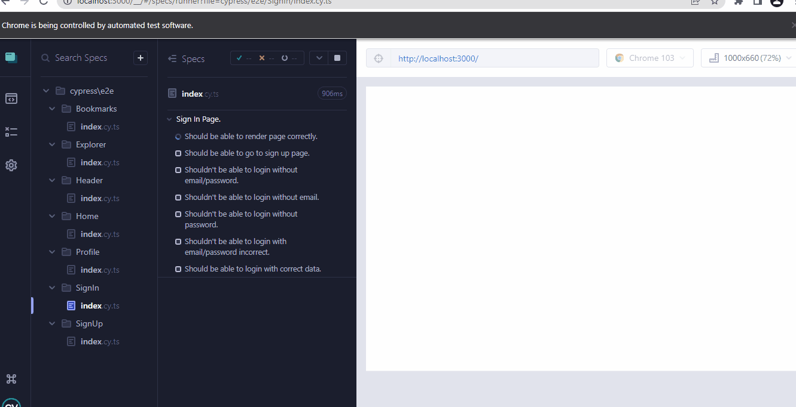

# 🌐 - Tweeter Frontend - 🌐

## Demo 📸

<p align='center'> </p>

<hr/>

## Application deploy with Vercel: :dash:

> https://tweeter-wsl.vercel.app

## Storybook deploy with Netlify: :dash:

> https://tweeter-storybook.netlify.app


## 📖 About the Project

Tweeter Frontend - This is a social network that posibility interact with tweets, user, comment and bookmarks. This was make with TypeScript how language programming, Storybook to documentation, Jest for unitary/integration tests, Cypress to e2e tests and all informatios/interactions was make consuming a own api make with nodejs.


## 📗 User Stories:

 - [x] - Create an account.
 - [x] - Sign in in your account.
 - [x] - View the optimal layout for the app depending on their device's screen size
 - [x] - View tweets by user.
 - [x] - Scroll infinite with SWR in all pages.
 - [x] - Filter tweets by Media, Likes, Top, Latest and Tweets
 - [x] - Follow/Unfolllow a user.
 - [x] - Change image of avatar and background from user.
 - [x] - List followings and followers from user.
 - [x] - Edit informations from user.
 - [x] - Show bookmarks filtered.
 - [x] - View your profile.
 - [x] - View users and profile from another users.
 - [x] - Search tweets by content.
 - [x] - Search people by name.
 - [x] - View your feed.
 - [x] - Create new tweet public/private.
 - [x] - Create new tweet with image.
 - [x] - Delete a tweet.
 - [x] - Like/unlike a tweet.
 - [x] - Save/unsave tweet how bookmark.
 - [x] - Create a comment.
 - [x] - Like/unlike a comment.
 - [x] - Delete a comment.
 - [x] - Show main trends.
 - [x] - Show a season that recommend who follow.
 - [x] - Toggle the color scheme between light and dark mode
 - [x] - Keep light/dark mode, even after refreshing the browser.
 - [x] - Logout your account.

## 🛠 Technologies

<li><a href="https://nextjs.org">Next.js</a></li>
<li><a href="https://www.typescriptlang.org">Typescript</a></li>
<li><a href="https://styled-components.com">Styled-components</a></li>
<li><a href="https://storybook.js.org">Storybook</a></li>
<li><a href="https://axios-http.com">Axios</a></li>
<li><a href="https://swr.vercel.app">SWR</a></li>
<li><a href="https://www.npmjs.com/package/nookies">Nookies</a></li>
<li><a href="https://www.npmjs.com/package/nextjs-progressbar">Nextjs-progressbar</a></li>
<li><a href="https://www.framer.com/motion/">Framer-motion</a></li>
<li><a href="https://styled-icons.dev">Styled-icons</a></li>
<li><a href="https://fontsource.org">Fontsource</a></li>
<li><a href="https://fkhadra.github.io/react-toastify/introduction">React-toastify</a></li>
<li><a href="https://react-dropzone.js.org">React-dropzone</a></li>
<li><a href="https://testing-library.com">React Testing Library</a></li>
<li><a href="https://react-hook-form.com">React-hook-form</a></li>
<li><a href="https://github.com/jquense/yup">Yup</a></li>
<li><a href="https://mswjs.io">MSW</a></li>
<li><a href="https://jestjs.io">Jest</a></li>
<li><a href="https://www.cypress.io">Cypress</a></li>
<li><a href="https://github.com/garmeeh/next-seo">Next-seo</a></li>
<li><a href="https://www.npmjs.com/package/next-pwa">Next-PWA</a></li>
<li><a href="https://eslint.org">Eslint</a></li>
<li><a href="https://prettier.io">Prettier</a></li>
<li><a href="https://editorconfig.org">EditorConfig</a></li>


## 💻 How to run the application

#### Pre-requisites:
You must have the tools installed:  <a href="https://git-scm.com">Git</a>, <a href="https://nodejs.org/en/">Node.js</a>. And create a new file called: .env.local, that follow .env.example credentials example for connect with a api or execute backend this application.

<pre>
# In the terminal, clone the project:
$ git clone https://github.com/Wesley-wsl/Tweeter-frontend.git

# Enter the project folder:
$ cd Tweeter-frontend

# Install dependencies:
$ yarn
or
$ npm install

# Run the application:
$ yarn dev
or
$ npm run dev
</pre>

Okay, now you can access the application from the route:  <a href="https://localhost:3000/">https://localhost:3000/</a>

## 🧪 Alright, but and the tests ?

Now the tests about this application was make with Jest and React Testing Library to unitary/integration tests, for tests e2e I used Cypress.

To run the unitary/integration tests you need only execute ```yarn test:coverage``` in the terminal in this directory.

Now if you want run the tests e2e in Cypress, first of all execute de backend and frontend, create an user and put email and password this user in a file in the root of this directory called cypress.env.json, make this how cypress.env.example. This is only to pass for authentication flux because it is validate with server side rendering, then mock this is not possible now. Maked this you need execute ```yarn cypress``` in your terminal in this directory and the magic will happen, you have access to e2e tests with cypress for execute in your machine.



<hr />

## Then is this... Thank you for stay and Enjoy. :-)


